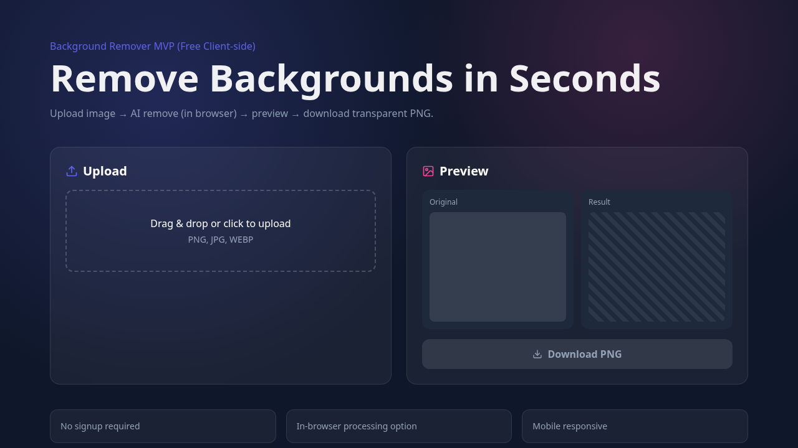
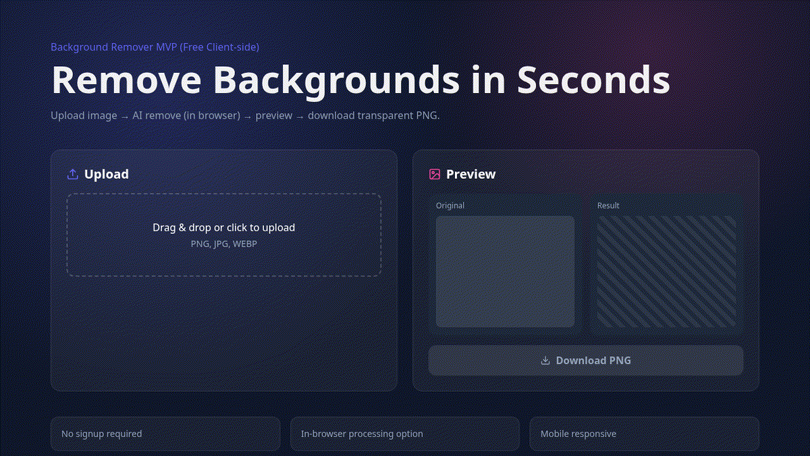

# ✂️ BG Remover MVP

Modern, privacy-first background remover MVP (client-side AI approach).

<p align="left">
  
  
  
  
  
</p>

## 🔗 Live Demo
- **GitHub Pages:** https://mhnoyon8.github.io/bg-remover-mvp/
- **Repository:** https://github.com/mhnoyon8/bg-remover-mvp

## 🖼️ Demo Preview


### Quick Walkthrough (GIF)


## 🧰 Stack
- React + TypeScript (Vite)
- Tailwind CSS
- Framer Motion
- Lucide React
- Transformers.js (client-side inference)

## ✨ Features (MVP)
- Drag & drop / click upload
- In-browser background removal flow
- Before/After preview blocks
- Transparent PNG download CTA
- Responsive dark UI

## 🚀 Quick Start
```bash
npm install
npm run dev
```

## 🏗️ Build
```bash
npm run build
npm run preview
```

## 📁 Project Structure
```text
bg-remover-mvp/
├── docs/                 # GitHub Pages output
├── public/
│   └── demo/
│       ├── screenshot.png
│       └── demo.gif
├── src/
│   ├── App.tsx
│   ├── main.tsx
│   └── index.css
├── package.json
├── tailwind.config.js
└── README.md
```

## 🌐 Deployment
### GitHub Pages (already configured)
- Source: `main` branch → `/docs`
- Live URL updates automatically on push.

### Vercel / Netlify
- Import repo and deploy with defaults.
- Build command: `npm run build`
- Publish dir (if static): `dist`

## 🗺️ Roadmap
- [ ] Real before/after slider
- [ ] Local history (IndexedDB)
- [ ] Background color/image switch
- [ ] Batch processing (phase 2)
- [ ] Performance split (worker + lazy model)

## ⚠️ Notes
- First model load may take longer.
- Client-side AI performance depends on user device/browser.

## 📄 License
MIT
